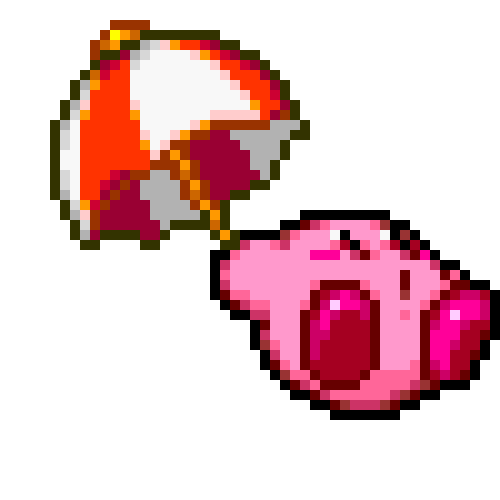

	
	

****

 	
	
✨"Todo progreso cuenta"✨

# Sobre mi
👋 ¡Hola a todos!, soy @MinervaHernandez.
Soy una estudiante egresada de Ingeniería en Sistemas y Comunicaciones, 
me entusiasma aprender cosas nuevas sobre casi cualquier tema siendo mis 
favoritos diseño web, artes plásticas y ecología.

 	

## Conocimientos 🌱
* HTML
* CSS
* JavaScript
* C
* JAVA
* SQL

## Intereses 👀
Aunque mis conocimientos se encuentran efocados hacia el diseño y 
desarrollo de los sistemas de información, me intereso mayormente 
por el Frontend.

## Contáctame 📫

	 
	 
	

****

<!---
- 💞️ I’m looking to collaborate on *web development projects, information systems and database.*
MinervaHernandez/MinervaHernandez is a ✨ special ✨ repository because its `README.md` (this file) appears on your GitHub profile.
You can click the Preview link to take a look at your changes.
--->
